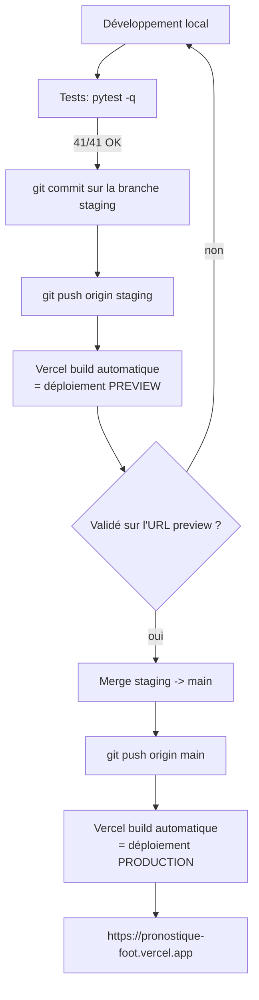

# Déploiement & CI/CD — Pronostics Coupe du Monde 2026

Petite documentation du déploiement de l'application : les services utilisés, les
variables d'environnement, et la procédure complète du développement jusqu'à la
mise en production.

- **Application en ligne** : https://pronostique-foot.vercel.app
- **Dépôt** : https://github.com/landOfCodeMonster/pronostique_foot

---

## 1. Architecture de déploiement

```
Navigateur (PC / iPhone / Android)
        │  HTTPS
        ▼
   Vercel  ── framework FastAPI natif (serverless)
        │            sert le frontend (HTML/CSS/JS + PWA)
        │            et l'API (/api/*)
        ├──────────────► football-data.org  (résultats & calendrier, plan gratuit)
        └──────────────► Turso / libSQL      (mémoire : pronostics, résultats, versions du modèle)
```

- Le **frontend** et le **backend FastAPI** sont servis par le **même** déploiement Vercel.
- La **base de données** est externalisée sur **Turso** (car le système de fichiers de
  Vercel est éphémère : un SQLite local serait effacé à chaque redémarrage).

---

## 2. Services utilisés

| Service | Rôle | URL |
|---|---|---|
| **GitHub** | Hébergement du code + **déclencheur du CI/CD** (chaque `push` lance un build Vercel) | https://github.com |
| **Vercel** | Build, hébergement et **déploiement automatique** (serverless, framework FastAPI natif) | https://vercel.com |
| **Turso** | Base de données **libSQL** (compatible SQLite) — la « mémoire » de l'app | https://turso.tech |
| **football-data.org** | Source de données football (matchs, scores) — plan gratuit, 10 req/min | https://www.football-data.org |
| **Homebrew / binaire `gh`** | Outil GitHub CLI utilisé pour l'authentification et le 1er push | https://cli.github.com |

### 2.1 Obtenir la clé API football-data.org

1. Aller sur **https://www.football-data.org/client/register**
2. Remplir le formulaire (nom, **email**, mot de passe), plan **gratuit (Free Tier)** — sans carte bancaire.
3. **Valider le compte** via le lien reçu par email.
4. Se connecter à l'**espace client** → la **clé API** (« API token ») s'affiche.
5. Copier la clé :
   - en local dans `.env` → `FOOTBALL_DATA_API_KEY=...`
   - dans **Vercel → Settings → Environment Variables** (`FOOTBALL_DATA_API_KEY`).

> L'app envoie cette clé dans l'en-tête HTTP `X-Auth-Token`. Plan gratuit :
> **10 requêtes/minute**, couvre la Coupe du Monde (code `WC`).

---

## 3. Variables d'environnement (Vercel → Settings → Environment Variables)

À définir pour l'environnement **Production** (et **Preview** si on teste depuis une branche) :

| Variable | Exemple / valeur | Où l'obtenir |
|---|---|---|
| `FOOTBALL_DATA_API_KEY` | `xxxxxxxx…` | football-data.org (espace client) |
| `TURSO_DATABASE_URL` | `libsql://…turso.io` | Turso (dashboard / `turso db show`) |
| `TURSO_AUTH_TOKEN` | `eyJ…` | Turso (`turso db tokens create`) |
| `COMPETITION_CODE` | `WC` | fixe (code Coupe du Monde) |

> En local, ces variables vivent dans le fichier `.env` (ignoré par git, jamais publié).
> Sans `TURSO_*`, l'app retombe automatiquement sur un SQLite local (pratique pour développer).

---

## 4. Configuration qui pilote le déploiement

- **`pyproject.toml`** — dit à Vercel quel est le point d'entrée FastAPI et quelles
  dépendances installer :
  ```toml
  [project]
  dependencies = ["fastapi==…", "uvicorn[standard]==…", "requests==…", "numpy==…", "libsql-experimental==0.0.55"]
  [tool.uv]
  package = false            # application, pas un paquet à compiler
  [tool.vercel]
  entrypoint = "backend.main:app"
  ```
- **`.vercelignore`** — exclut du déploiement ce qui est inutile en prod
  (`tests/`, `docs/`, `data/`, `.venv/`…).
- **`.gitignore`** — empêche de publier les secrets (`.env`) et la base locale (`data/`).

---

## 5. Procédure CI/CD — du développement au déploiement

Le CI/CD repose sur l'**intégration Git de Vercel** : pas de serveur de build à gérer,
chaque `push` GitHub déclenche automatiquement un build + déploiement.



### Détail des étapes

1. **Développer en local**
   ```bash
   python3 -m venv .venv && source .venv/bin/activate
   pip install -r requirements.txt
   cp .env.example .env        # renseigner les clés
   uvicorn backend.main:app --reload   # http://127.0.0.1:8000
   ```

2. **Tester** (obligatoire avant de pousser) :
   ```bash
   pytest -q                   # doit afficher "41 passed"
   ```

3. **Committer sur `staging`** (jamais directement sur `main`) :
   ```bash
   git checkout staging
   git add -A && git commit -m "feat: …"
   git push origin staging
   ```

4. **Vercel déploie automatiquement** une **Preview** pour `staging` (URL `…-staging-….vercel.app`).
   → on teste cette URL (sur téléphone aussi).

5. **Mettre en production** une fois la preview validée :
   ```bash
   git checkout main
   git merge --no-ff staging
   git push origin main
   ```
   → Vercel déploie automatiquement en **Production** sur https://pronostique-foot.vercel.app

### Mapping branche → environnement Vercel

| Branche Git | Environnement Vercel | URL |
|---|---|---|
| `main` | **Production** | https://pronostique-foot.vercel.app |
| `staging` (ou toute autre) | **Preview** | URL générée par déploiement |

---

## 6. Mise en place initiale (une seule fois)

1. **GitHub** : créer le dépôt, `git push -u origin main` (authentification via `gh auth login`).
2. **Turso** : créer un compte + une base → récupérer `TURSO_DATABASE_URL` et `TURSO_AUTH_TOKEN`.
3. **Vercel** : « Add New Project » → importer le dépôt GitHub → ajouter les 4 variables
   d'environnement → déployer. Vercel détecte FastAPI via `pyproject.toml`.

---

## 7. Rollback (revenir en arrière)

- **Le plus simple** : Vercel → onglet **Deployments** → choisir un déploiement précédent
  qui marchait → **« Promote to Production »** (instantané, sans git).
- **Par git** : `git revert <commit>` sur `main` puis `git push origin main` (redéploie).

---

## 8. Points d'attention (spécifiques au serverless)

- **Paramètres SQL en tuple** : Turso/libSQL refuse les listes comme paramètres
  (`cursor.execute(sql, tuple(params))`). Ne pas réintroduire de listes dans `storage.py`.
- **Système de fichiers en lecture seule** sur Vercel sauf `/tmp` : le cache disque
  pointe vers `/tmp` en prod (géré dans `config.py`).
- **Limite API** : football-data.org = 10 req/min. L'app ne fait qu'un appel mis en
  cache (60 s) → ~1 req/min max.
- **Tests = barrière qualité locale** : ils tournent en local avant chaque push.
  *Amélioration possible* : ajouter un workflow **GitHub Actions** qui lance `pytest`
  automatiquement à chaque push/PR (vrai CI), pour bloquer un merge si un test casse.
